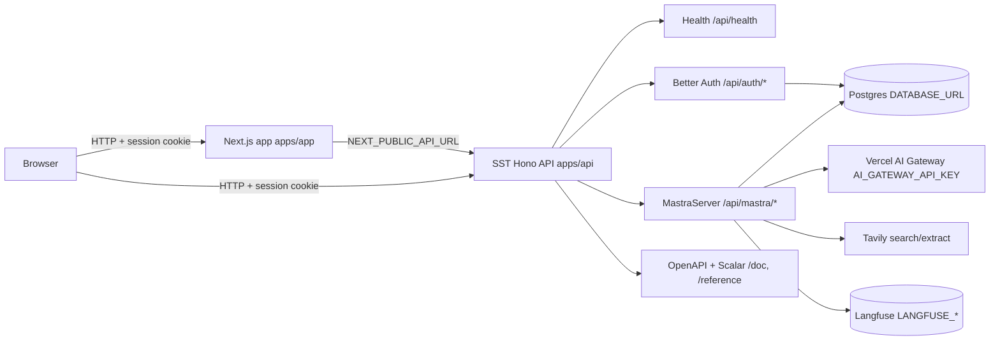

# agent-luthen

Monorepo for a clinical-guidelines research agent. A Next.js chat app talks to a Hono API that hosts Better Auth and a Mastra agent runtime. SST deploys both services to AWS.

## How it works



Local ports (from `packages/infra/ports.ts`):

| Service       | Port | URL                   |
| ------------- | ---- | --------------------- |
| Web app       | 3000 | http://localhost:3000 |
| API           | 3001 | http://localhost:3001 |
| Mastra Studio | 3002 | http://localhost:3002 |

Non-local stages use `{stage}.agent-luthen.slchow.com` for the web app and `{stage}.api.agent-luthen.slchow.com` for the API.

## Apps

### Web (`apps/app`)

Next.js App Router chat UI. Authenticated users land on the clinical research agent and can open threads. The app talks to Mastra through `@mastra/client-js` at `{API}/api/mastra` with cookie credentials.

- Locales: `en`, `zh-cn`, `zh-hk` (`next-intl`)
- Auth: Better Auth client against the API (`packages/auth`)
- Chat: streams Mastra chunks, tool calls, sources, and usage

### API (`apps/api`)

Hono server started from `apps/api/src/index.ts`. `apps/api/src/app.ts` mounts:

- Health under `/api`
- Mastra under `/api/mastra` (`apps/api/src/lib/configure-mastra.ts`)
- Better Auth under `/api/auth/*`
- OpenAPI + Scalar docs

## API routes

### Health

- `GET /api/health` — `{ "ok": true }`

### Authentication (Better Auth)

- `GET` / `POST` `/api/auth/*` — handled by `packages/auth/server.ts`

Email/password is enabled; sign-up is disabled (accounts are provisioned). Plugins include admin, organization, OpenAPI, multi-session, and Next.js cookies.

### Agent (Mastra)

- `GET /api/mastra/openapi.json` — Mastra OpenAPI schema
- Other agent/thread/memory endpoints live under `/api/mastra/*` (auth required except the OpenAPI document)

### Documentation

- `GET /doc` — OpenAPI JSON for Hono app routes
- `GET /reference` — Scalar UI, aggregating:
  - `/doc`
  - `/api/auth/open-api/generate-schema`
  - `/api/mastra/openapi.json`

## Mastra agent

Configured in [`packages/mastra`](packages/mastra/):

- `packages/mastra/src/mastra/index.ts` — Mastra instance: Better Auth, Postgres storage, Langfuse, Tavily tools
- `packages/mastra/src/mastra/agents/research/agent.ts` — **Clinical Guidelines Researcher** (`clinical-research-agent`), exposed as a durable agent
- `packages/mastra/src/mastra/models/index.ts` — models via Vercel AI Gateway (currently `deepseek/deepseek-v4-flash`)
- `packages/mastra/src/mastra/tools/tavily-tools.ts` — Tavily search and extract

Mastra Studio (`bun run mastra:studio`) loads the same SST secrets as the API.

## Database

Postgres is used for:

- Better Auth tables (`packages/db/schema/auth.ts`)
- Mastra storage (Mastra creates its own memory/task tables)

Schema work is Drizzle in `packages/db`. Apply locally with `bun run setup:schema` (auth generate → drizzle generate → migrate → push).

## Development and deployment

Requires [Bun](https://bun.sh) and AWS SSO (`bun run sso` uses the `sinlongchow` session; SST uses the `luthen` AWS profile).

### Local

```bash
bun install
bun run setup:schema   # first time, or after schema changes
bun dev                # sst dev --stage local (web + API)
```

Useful extras:

- `bun run mastra:studio` — Mastra Studio with SST secrets
- `bun run db:studio` — Drizzle Studio
- `bun run killports` — free local ports 3000–3002

### Deploy

```bash
bun run deploy:dev     # sst deploy --stage dev
```

## Environment variables (SST secrets)

Declared in `packages/infra/secrets.ts` and linked into the API service.

| Secret                                                              | Used for                                    |
| ------------------------------------------------------------------- | ------------------------------------------- |
| `BETTER_AUTH_SECRET`                                                | Session signing                             |
| `DATABASE_URL`                                                      | Postgres for auth and Mastra storage        |
| `AI_GATEWAY_API_KEY`                                                | Vercel AI Gateway (LLM calls)               |
| `LANGFUSE_PUBLIC_KEY` / `LANGFUSE_SECRET_KEY` / `LANGFUSE_BASE_URL` | Mastra observability                        |
| `TAVILY_API_KEY`                                                    | Agent web search / extract                  |
| `PINECONE_API_KEY`                                                  | Linked to the API; not used by app code yet |

Web env (injected by SST in `packages/infra/app.ts`):

- `NEXT_PUBLIC_API_URL`
- `NEXT_PUBLIC_AUTH_COOKIE_PREFIX`

## Repository layout

- [`apps/app`](apps/app/) — Next.js chat UI
- [`apps/api`](apps/api/) — Hono API, route wiring, OpenAPI
- [`packages/auth`](packages/auth/) — Better Auth server, client, and cookie helpers
- [`packages/mastra`](packages/mastra/) — agent, tools, Mastra config
- [`packages/db`](packages/db/) — Drizzle schema and migrations
- [`packages/infra`](packages/infra/) — SST secrets, VPC/cluster, API service, Next.js app

Other entrypoints:

- `sst.config.ts` — SST app and stack imports
- `apps/api/src/lib/configure-openapi.ts` — Scalar docs sources
- `scripts/mastra-studio.sh` — Studio under `sst shell`
